# pan-share

AI SaaS Boilerplate Template (ShipAny Template Two v1.8.2)

## 架构总览

```mermaid
graph TD
    A["(根) pan-share"] --> B["app"]
    A --> C["core"]
    A --> D["shared"]
    A --> E["extensions"]
    A --> F["config"]

    B --> B1["[locale]/(admin) - 管理后台"]
    B --> B2["[locale]/(auth) - 认证页面"]
    B --> B3["[locale]/(chat) - 聊天界面"]
    B --> B4["[locale]/(docs) - 文档系统"]
    B --> B5["[locale]/(landing) - 落地页/用户中心"]
    B --> B6["api - API路由"]

    C --> C1["auth - Better-Auth认证"]
    C --> C2["db - 数据库连接"]
    C --> C3["docs - 文档源"]
    C --> C4["i18n - 国际化"]
    C --> C5["rbac - 权限管理"]
    C --> C6["theme - 主题系统"]

    D --> D1["blocks - UI组件块"]
    D --> D2["hooks - 自定义Hooks"]
    D --> D3["lib - 工具库"]
    D --> D4["models - 数据模型"]
    D --> D5["services - 业务服务"]
    D --> D6["types - 类型定义"]

    E --> E1["ai - AI服务集成"]
    E --> E2["payment - 支付集成"]
    E --> E3["storage - 存储服务"]
    E --> E4["email - 邮件服务"]
    E --> E5["analytics - 分析工具"]
    E --> E6["ads - 广告系统"]

    F --> F1["db/schema - 数据库Schema"]
    F --> F2["locale - 国际化文案"]
    F --> F3["theme - 主题配置"]
```



## 技术栈

| 分类 | 技术 |
|------|------|
| 框架 | Next.js 16.0.7 + React 19.2.1 |
| 数据库 | Drizzle ORM + PostgreSQL/MySQL/SQLite |
| 认证 | Better-Auth 1.3.7 |
| AI | @ai-sdk/react + Replicate + Gemini + Fal + KIE |
| 支付 | Stripe + PayPal + Creem |
| 样式 | Tailwind CSS v4 + Radix UI + CVA |
| 国际化 | next-intl |
| 部署 | Vercel + Cloudflare |

## 模块索引

| 模块 | 路径 | 职责 |
|------|------|------|
| **app** | `src/app` | Next.js App Router 页面路由 |
| **core/auth** | `src/core/auth` | 用户认证模块 (Better-Auth) |
| **core/db** | `src/core/db` | 数据库连接与管理 |
| **core/rbac** | `src/core/rbac` | 基于角色的权限控制 |
| **core/i18n** | `src/core/i18n` | 国际化配置 |
| **core/theme** | `src/core/theme` | 主题切换 (明暗模式) |
| **extensions/ai** | `src/extensions/ai` | AI 服务集成层 |
| **extensions/payment** | `src/extensions/payment` | 支付网关集成 |
| **extensions/storage** | `src/extensions/storage` | 文件存储服务 |
| **shared/models** | `src/shared/models` | 数据访问层 (DAL) |
| **shared/services** | `src/shared/services` | 业务逻辑服务层 |
| **shared/blocks** | `src/shared/blocks` | UI 组件块 |

## 数据库 Schema

### 核心表结构

- **user/session/account/verification** - 用户认证相关
- **order/subscription/credit** - 支付与积分系统
- **apikey** - API 密钥管理
- **role/permission/role_permission/user_role** - RBAC 权限模型
- **ai_task/chat/chat_message** - AI 任务与聊天
- **taxonomy/post** - 内容分类与文章
- **pan_share** - 网盘分享 (本项目特定功能)

## 运行与开发

```bash
# 安装依赖
pnpm install

# 开发模式
pnpm dev

# 构建
pnpm build

# 数据库迁移
pnpm db:migrate

# 运行 RBAC 初始化
pnpm rbac:init
```

## 测试策略

- 使用 Next.js 内置测试工具
- 组件测试基于 React Testing Library
- API 路由测试使用集成测试

## 编码规范

- TypeScript 严格模式
- Tailwind CSS v4 原子化样式
- 组件按功能块组织 (`shared/blocks/`)
- 数据模型与业务逻辑分离 (`models/` vs `services/`)

## AI 使用指引

### AI 服务配置

项目支持多 AI 服务商集成：

| 服务商 | 配置变量 | 用途 |
|--------|----------|------|
| Replicate | `REPLICATE_API_TOKEN` | 图像/视频/音频生成 |
| Gemini | `GEMINI_API_KEY` | 对话模型 |
| Fal | `FAL_API_KEY` | 实时推理 |
| KIE | `KIE_API_KEY` | 图像提取 |

### AI 管理器

通过 `src/shared/services/ai.ts` 中的 `AIManager` 统一管理所有 AI 提供商。

## 沟通协议

- 多文件任务：创建前明确列出所有文件，确认后再执行
- 阶段完成：每个阶段完成后主动确认再继续
- 长响应：拆分成多个部分，每部分确认后再继续

## 变更记录

- **2026-02-04**: 项目初始化架构文档生成
